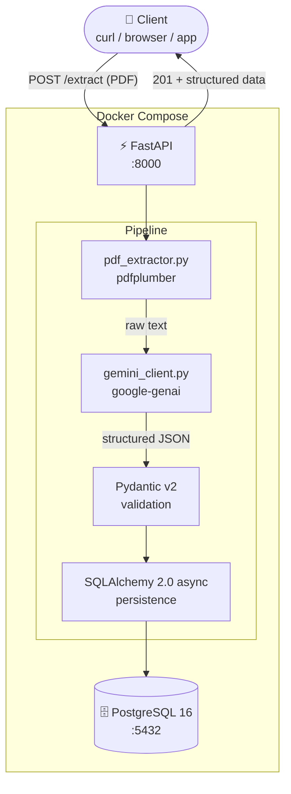

# pdf-to-structured-data

> Production-ready ETL pipeline extracting structured data from PDFs using Gemini AI, FastAPI, Pydantic v2, PostgreSQL, and Docker Compose.


---

## What it does

Upload any text-based PDF — invoice, contract, report — and the pipeline extracts structured fields using Google Gemini AI, validates the output strictly with Pydantic v2, and stores the result in PostgreSQL. The entire stack starts with one command.

```bash
curl -X POST http://localhost:8000/extract \
  -F "file=@invoice.pdf"
```

```json
{
  "record_id": 1,
  "extraction": {
    "document_type": "invoice",
    "issuer_name": "Acme Corp",
    "total_amount": 1500.00,
    "currency": "USD",
    "raw_confidence": 0.97
  }
}
```

---

## Architecture



---

## Features

- **PDF ingestion** — accepts any text-based PDF via multipart upload
- **LLM extraction** — Gemini 2.5 Flash extracts 10 structured fields per document
- **Strict validation** — Pydantic v2 rejects malformed LLM output before it reaches the database
- **Async persistence** — SQLAlchemy 2.0 async ORM writes to PostgreSQL without blocking
- **REST API** — four endpoints: extract, retrieve by ID, paginated list, health check
- **One-command deploy** — Docker Compose orchestrates API and database with health checks
- **Full test suite** — pytest with async fixtures and mocked Gemini API
- **CI/CD** — GitHub Actions runs ruff and pytest on every push

---

## Tech Stack

| Layer | Technology |
|---|---|
| Language | Python 3.12 |
| API framework | FastAPI + Uvicorn |
| LLM | Google Gemini 2.5 Flash (`google-genai`) |
| PDF parsing | pdfplumber |
| Validation | Pydantic v2 |
| ORM | SQLAlchemy 2.0 async |
| Database | PostgreSQL 16 |
| Containers | Docker + Docker Compose |
| Testing | pytest + pytest-asyncio + httpx |
| Linting | ruff |

---

## Quick Start

**Prerequisites:** Docker Desktop, a free [Gemini API key](https://aistudio.google.com/apikey)

```bash
# 1. Clone and configure
git clone https://github.com/dingzehu/pdf-to-structured-data.git
cd pdf-to-structured-data
cp .env.example .env
# Open .env and add your GEMINI_API_KEY

# 2. Start the stack
docker compose up --build

# 3. Extract data from a PDF
curl -X POST http://localhost:8000/extract \
  -F "file=@sample_pdfs/sample_invoice.pdf"
```

| URL | What you see |
|---|---|
| http://localhost:8000/docs | Interactive API (Swagger UI) |
| http://localhost:8000/health | Health check |

---

## API Reference

### `POST /extract`

Upload a PDF and receive structured extracted data.

**Request:** `multipart/form-data` with a `file` field (PDF only)

**Response `201`:**
```json
{
  "record_id": 1,
  "filename": "invoice.pdf",
  "extraction": {
    "document_type": "invoice",
    "issuer_name": "Acme Corp",
    "recipient_name": "John Doe",
    "document_date": "2024-01-15",
    "document_number": "INV-001",
    "total_amount": 1500.00,
    "currency": "USD",
    "line_items": [
      {
        "description": "Consulting",
        "quantity": 10,
        "unit_price": 150.00,
        "total": 1500.00
      }
    ],
    "summary": "Invoice from Acme Corp to John Doe for consulting services.",
    "raw_confidence": 0.97
  },
  "created_at": "2024-01-15T12:00:00Z"
}
```

**Errors:** `422` if Pydantic validation fails · `500` if Gemini is unavailable

---

### `GET /results/{record_id}`

Retrieve a stored extraction by database ID.

**Response `200`:** same schema as `POST /extract`
**Response `404`:** record not found

---

### `GET /results?page=1&size=10`

Paginated list of all past extractions, newest first.

**Response `200`:**
```json
{
  "total": 42,
  "page": 1,
  "size": 10,
  "results": [...]
}
```

---

### `GET /health`

**Response `200`:**
```json
{ "status": "ok", "db": "connected", "gemini": "reachable" }
```

---

## Project Structure

```
pdf-to-structured-data/
├── app/
│   ├── main.py              # FastAPI app factory + lifespan
│   ├── config.py            # Settings via pydantic-settings
│   ├── database.py          # Async engine + session factory
│   ├── models/
│   │   ├── db.py            # SQLAlchemy ORM model
│   │   └── schemas.py       # Pydantic v2 request/response schemas
│   ├── services/
│   │   ├── pdf_extractor.py # pdfplumber: PDF → raw text
│   │   ├── gemini_client.py # Gemini API: text → structured JSON
│   │   └── pipeline.py      # Orchestration: PDF → LLM → DB
│   └── api/
│       └── routes.py        # FastAPI route handlers
├── tests/                   # pytest unit + integration tests
├── sample_pdfs/             # synthetic test PDFs
├── Dockerfile
├── docker-compose.yml
├── pyproject.toml
└── .env.example
```

---

## Development

```bash
# Install dependencies
pip install -e ".[dev]"

# Run all tests (all external calls are mocked — no API key needed)
pytest tests/ -v

# Coverage report
pytest tests/ --cov=app --cov-report=term-missing

# Lint
ruff check .
```

---

## Environment Variables

| Variable | Required | Description |
|---|---|---|
| `GEMINI_API_KEY` | Yes | Get one free at [aistudio.google.com/apikey](https://aistudio.google.com/apikey) |
| `DATABASE_URL` | No | PostgreSQL connection string — defaults to the Docker Compose service |
| `GEMINI_MODEL` | No | Defaults to `gemini-2.5-flash` |

See [`.env.example`](.env.example) for the full template.

---

## Design decisions

- **FastAPI over Flask or Django REST** — async-first design means Gemini API calls do not block the worker; native Pydantic v2 integration handles request/response validation; automatic `/docs` requires no extra documentation work.
- **Pydantic v2 strict validation** — LLM output is unpredictable. Gemini occasionally omits fields, returns wrong types, or wraps JSON in markdown fences. Pydantic v2 rejects non-conforming output before it reaches the database, making the pipeline deterministic regardless of model variance.
- **SQLAlchemy 2.0 async** — non-blocking database writes allow FastAPI to serve concurrent requests while PostgreSQL commits a record; `Mapped[]` type annotations provide full IDE inference without duplicate column definitions.
- **pdfplumber over PyMuPDF or PyPDF2** — most accurate text extraction for text-based PDFs, cleaner whitespace handling, and better table structure preservation for downstream LLM prompting. **Limitation:** pdfplumber cannot extract text from scanned PDFs (image-only pages return an empty string). To handle scanned documents, the pipeline would need an OCR step (e.g. `pytesseract`) or the PDF would need to be sent directly to Gemini as a file upload.

---

## License

MIT — see [LICENSE](LICENSE).